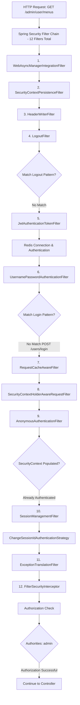

# Issue
- actuator health 检查失败, status 为down。 
  - application.yml配置的service，actuator都会去做health check，确保每个service是可连接的状态

    

- [x] throw AccessDeniedException，但是被AuthenticationEntryPoint而不是AccessDeniedHandler catch住

  > 原因是因为设置了    
  >
  > http.addFilterBefore(jwtAuthenticationTokenFilter, UsernamePasswordAuthenticationFilter.class);
  >
  > http.addFilterAfter(jwtAuthenticationTokenFilter, ExceptionTranslationFilter.class);
  >
  > 导致JWTAuthenticationFilter重复设置并且位置出现在ExceptionTranslationFilter之前，UsernamePasswordAuthenticationFilter之后。
  >
  > 该问题取决于在响应filter - AnonymousAuthenticationFilter时，是否authentication对象为null，如果JWTAuthenticationFilter在其之前，便会将authentication对象设置到SecurityContextHolder中，否则系统会自动 Populated SecurityContextHolder with anonymous token

- [ ] 设计在JwtAuthenticationTokenFilter验证时， token失效重定向到 /users/login 的场景


# Spring Security

## Authentication 机制

```java
// 添加JWT认证过滤器，只在UsernamePasswordAuthenticationFilter之前添加一次
http.addFilterBefore(jwtAuthenticationTokenFilter, UsernamePasswordAuthenticationFilter.class);
```

在`UsernamePasswordAuthenticationFilte`r前添加自定义jwtAuthenticationTokenFilter，确保所以请求，会先走JWT认证，使用token进行验证，提高了效率


```java
http.addFilterAfter(jwtAuthenticationTokenFilter, ExceptionTranslationFilter.class);
```

该代码已被删除，上下两条语句若都执行，会影响jwtAuthenticationTokenFilter的执行顺序。

在`ExceptionTranslationFilter`后添加自定义jwtAuthenticationTokenFilter，确保其抛出的`AuthenticationException`或`AccessDeniedException`会被ExceptionTranslationFilter捕获，将其转换为HTTP响应，比如401未授权或403禁止访问。


Populated SecurityContextHolder with anonymous token: 'AnonymousAuthenticationToken'：

若未通过jwtAuthenticationTokenFilter验证，springsecurity会填充AnonymousAuthenticationToken到SecurityContextHolder中。即便抛出AccessDeniedException：

- AccessDeniedException → 如果用户已认证，使用 [AccessDeniedHandler]AccessDeniedHandlerImpl.java )
- AccessDeniedException → 如果用户未认证（匿名），转换为 InsufficientAuthenticationException（AuthenticationException的子类），使用 [AuthenticationEntryPoint]AuthenticationEntryPointImpl.java )


## Authorization机制 - FilterSecurityInterceptor

```mermaid
sequenceDiagram
    participant Client
    participant FilterSecurityInterceptor
    participant MetadataSource
    participant AccessDecisionManager

    Client->>FilterSecurityInterceptor: 请求路径
    FilterSecurityInterceptor->>MetadataSource: getAttributes(path)
    alt 返回非null（有权限规则）
        MetadataSource-->>FilterSecurityInterceptor: ConfigAttribute集合
        FilterSecurityInterceptor->>AccessDecisionManager: decide(authentication, attributes)
        AccessDecisionManager-->>FilterSecurityInterceptor: 通过/拒绝
    else 返回null（无权限规则）
        MetadataSource-->>FilterSecurityInterceptor: null
        FilterSecurityInterceptor->>Client: 直接放行
    end
```



## Filter chain list




# Exception 处理

## 常用注解

在 Spring Boot 中，处理异常通常有几种常用的注解，它们可以帮助你以更优雅、集中的方式管理应用程序的错误。

### 1. `@ControllerAdvice` 和 `@RestControllerAdvice`


这是 Spring Boot 异常处理的核心注解。它们让你能够将异常处理逻辑集中在一个类中，而不是分散在各个控制器里。

- **`@ControllerAdvice`**：用于处理所有 `@Controller` 定义的控制器抛出的异常。它可以处理视图（View）渲染或返回 JSON 的异常。
- **`@RestControllerAdvice`**：它是 `@ControllerAdvice` 和 `@ResponseBody` 的结合体，专门用于处理 RESTful API（即 `@RestController`）抛出的异常。它默认会将处理结果作为 JSON 返回。

这两个注解通常会配合 `@ExceptionHandler` 使用。

### 2. `@ExceptionHandler`

这个注解用于标记一个方法，表示该方法专门用来处理特定类型的异常。它通常用在 `@ControllerAdvice` 或 `@Controller` 注解的类中。

```java
// 详见ControllerAdviceHandler.java
@Log4j2
@RestControllerAdvice
public class ControllerAdviceHandler {

    @ExceptionHandler(value = BizException.class)
    public ResultVO<?> errorHandler(BizException e) {
        return ResultVO.fail(e.getCode(), e.getMessage());
    }

    @ExceptionHandler(MethodArgumentNotValidException.class)
    public ResultVO<?> errorHandler(MethodArgumentNotValidException e) {
        return ResultVO.fail(StatusCodeEnum.VALID_ERROR.getCode(), Objects.requireNonNull(e.getBindingResult().getFieldError()).getDefaultMessage());
    }

    @ExceptionHandler(value = Exception.class)
    public ResultVO<?> errorHandler(Exception e) {
        e.printStackTrace();
        return ResultVO.fail(StatusCodeEnum.SYSTEM_ERROR.getCode(), StatusCodeEnum.SYSTEM_ERROR.getDesc());
    }

}
```

# 日志log库

项目中使用到了lombok提供的两个log注解

### @Slf4j

- @Slf4j：日志抽象层（推荐）
- @Slf4j 是 SLF4J (Simple Logging Facade for Java) 提供的注解。SLF4J 的核心思想是日志门面模式。

SpringBoot 默认使用Logback作为日志框架，且已经将其与SLF4J接口进行集成。若取消切换底层的log实现，需要在pom文件中，排除默认的logback依赖并引入新的Log库依赖（如Log4j2）


使用时，只需要在类上加上 `@Slf4j` 注解，它就会自动生成一个名为 `log` 的 `Logger` 对象。

```java
import lombok.extern.slf4j.Slf4j;

@Slf4j
public class MyService {

    public void doSomething() {
        log.info("这是一个 info 级别的日志信息。");
        log.debug("这是一个 debug 级别的日志信息。");
    }
}
```

### @Log4j2

属于具体的日志实现，是 **Log4j2** 这个具体的日志框架提供的注解。

使用时，通过注解的方式，自动生成一个名为 `log` 的 `Logger` 对象。


### 对比

在 Spring Boot 和其他 Java 项目中，`@Log4j2` 和 `@Slf4j` 是两个非常常见的注解，它们都用于简化日志记录。不过，它们来自不同的库，并且在使用方式和功能上略有不同。

| 特性       | **@Slf4j**                                   | **@Log4j2**                    |
| ---------- | -------------------------------------------- | ------------------------------ |
| **类型**   | **日志门面（接口）**                         | **日志实现（具体框架）**       |
| **依赖**   | 需要一个具体的底层日志框架                   | 必须依赖 Log4j2                |
| **灵活性** | 高，可以轻松切换底层框架                     | 低，与 Log4j2 强绑定           |
| **推荐度** | **高**，Spring Boot 默认推荐 SLF4J + Logback | 如果对 Log4j2 的特定功能有需求 |


# MySQL数据库梳理

Job表单

- t_job: 存储了后台job的详细信息
- t_job_log：存储了每次job执行的日志信息

User表单

- t_user_auth:用户的auth信息（用户名及密码信息）
- t_user_info:用户的基本信息
- t_user_role: 用户userid和roleid

Role表单

- t_role: 角色的详细信息（分为admin、test、user）
- t_role_menu: 关联表单 role - menu
- t_role_resource: 关联表单 role - resource

Menu表单:

- t_menu:

Resource表单：


## DDL

### 行格式

ROW_FORMAT=DYNAMIC 详解

`ROW_FORMAT=DYNAMIC` 是 MySQL InnoDB 存储引擎的**行格式**配置，用于控制数据在磁盘上的存储方式，也是 MySQL8.0+的默认行格式。

#### 什么是行格式？

行格式决定了：
- 数据行在物理存储中的组织方式
- 变长字段的存储策略
- 大字段的处理方式

#### InnoDB 支持的行格式

| 行格式      | 特点                   | 适用场景       |
| ----------- | ---------------------- | -------------- |
| **DYNAMIC** | 现代格式，完全离页存储 | **推荐使用**   |
| COMPRESSED  | 支持压缩               | 节省空间       |
| REDUNDANT   | 旧格式，兼容性好       | 历史遗留       |
| COMPACT     | 紧凑格式               | MySQL 5.0 默认 |

#### DYNAMIC 格式的特点

##### 1. **完全离页存储**
```sql
-- 对于 TEXT、BLOB、VARCHAR 等变长字段
CREATE TABLE example (
  id int,
  content TEXT,           -- 大字段
  description VARCHAR(1000) -- 长字符串
) ROW_FORMAT=DYNAMIC;
```

**存储策略**：
- 短数据：直接存储在数据页中
- 长数据：存储在**溢出页**中，数据页只保留 20 字节的指针

##### 2. **动态行长度**
```
小数据行：[id][短content][短description] → 存储在同一页
大数据行：[id][指针→content][指针→description] → 内容存储在溢出页
```

##### 3. **优化的空间利用**
- 自动判断字段是否需要离页存储
- 最大化数据页的利用率
- 减少页分裂

#### 与其他格式的对比

##### COMPACT vs DYNAMIC
```sql
-- COMPACT 格式 (旧)
ROW_FORMAT=COMPACT
-- 变长字段前768字节存储在数据页，剩余部分存储在溢出页

-- DYNAMIC 格式 (新)
ROW_FORMAT=DYNAMIC  
-- 变长字段完全存储在溢出页，数据页只保留指针
```

##### 实际影响示例

```sql
-- 这个表有大字段
CREATE TABLE `t_job` (
  `invoke_target` varchar(500),  -- 较长字符串
  `cron_expression` varchar(255),
  `remark` varchar(500)          -- 较长字符串
) ROW_FORMAT=DYNAMIC;
```

**DYNAMIC 的优势**：
- 当 `invoke_target` 或 `remark` 很长时，完全存储在溢出页
- 数据页可以容纳更多的记录
- 提高缓存效率

#### 为什么选择 DYNAMIC？

##### 1. **MySQL 8.0+ 默认格式**
```sql
-- MySQL 8.0 中，这两句是等价的
CREATE TABLE t1 (...);
CREATE TABLE t1 (...) ROW_FORMAT=DYNAMIC;
```

##### 2. **适合现代应用**
- 支持更大的索引前缀 (3072 字节)
- 优化的变长字段处理
- 更好的空间利用率

##### 3. **性能优势**
```sql
-- 查询只需要基本字段时
SELECT id, job_name, status FROM t_job WHERE status = 1;
-- DYNAMIC: 不需要读取大字段的溢出页，性能更好
```

#### 实际影响

##### 对于 t_job 表：
```sql
-- 这些字段可能触发离页存储：
`invoke_target` varchar(500)    -- 调用目标字符串（可能很长）
`remark` varchar(500)          -- 备注信息（可能很长）

-- 当这些字段内容较长时：
-- DYNAMIC: 完全存储在溢出页，主页面更紧凑
-- COMPACT: 前768字节在主页面，可能造成页面浪费
```

#### 总结

`ROW_FORMAT=DYNAMIC` 的作用：

1. **现代化存储**：MySQL 8.0+ 推荐格式
2. **智能存储**：自动决定大字段的存储位置
3. **性能优化**：减少不必要的 I/O 操作
4. **空间效率**：更好的页面利用率

对于包含 `TEXT`、`BLOB` 或长 `VARCHAR` 字段的表，**DYNAMIC 是最佳选择**！


### COLLATE详解

`COLLATE` 是 MySQL 中用于指定**字符串比较和排序规则**的关键字。它决定了如何比较、排序和匹配字符串数据。

#### 在 t_job 表中的 COLLATE 使用

让我分析 `t_job` 表中的 COLLATE 设置：

```sql
CREATE TABLE `t_job` (
  `job_name` varchar(64) CHARACTER SET utf8mb4 COLLATE utf8mb4_general_ci NOT NULL DEFAULT '',
  `job_group` varchar(64) CHARACTER SET utf8mb4 COLLATE utf8mb4_general_ci NOT NULL DEFAULT 'DEFAULT',
  `invoke_target` varchar(500) CHARACTER SET utf8mb4 COLLATE utf8mb4_general_ci NOT NULL,
  `cron_expression` varchar(255) CHARACTER SET utf8mb4 COLLATE utf8mb4_general_ci NULL DEFAULT '',
  `remark` varchar(500) CHARACTER SET utf8mb4 COLLATE utf8mb4_general_ci NULL DEFAULT ''
) ENGINE = InnoDB CHARACTER SET = utf8mb4 COLLATE = utf8mb4_general_ci;
```

####  COLLATE 的作用

#####  1. **字符串比较规则**
```sql
-- 不同 COLLATE 的比较结果不同
SELECT 'A' = 'a';  -- 结果取决于 COLLATE 设置

-- utf8mb4_general_ci: 不区分大小写
'Hello' = 'HELLO'  -- TRUE
'Hello' = 'hello'  -- TRUE

-- utf8mb4_bin: 区分大小写
'Hello' = 'HELLO'  -- FALSE  
'Hello' = 'hello'  -- FALSE
```

#####  2. **排序规则**
```sql
-- utf8mb4_general_ci 排序
SELECT job_name FROM t_job ORDER BY job_name;
-- 结果: Apple, apple, Banana, banana

-- utf8mb4_bin 排序  
SELECT job_name FROM t_job ORDER BY job_name;
-- 结果: Apple, Banana, apple, banana (大写字母优先)
```


#### 默认的 COLLATE 规则

在这个数据库中，默认的 COLLATE 规则是 **`utf8mb4_0900_ai_ci`**。

##### 两种 COLLATE 规则对比

| 特性 | `utf8mb4_0900_ai_ci` | `utf8mb4_general_ci` |
|------|---------------------|---------------------|
| **MySQL 版本** | 8.0+ 默认 | 5.7 及以前的默认 |
| **性能** | 稍慢 | 更快 |
| **准确性** | 更准确的 Unicode 排序 | 简化的排序规则 |
| **语言支持** | 更好的多语言支持 | 基本多语言支持 |

##### COLLATE 规则解析

`utf8mb4_0900_ai_ci` (主要默认规则)

- **utf8mb4**: 完整 UTF-8 字符集（支持 emoji）
- **0900**: Unicode 9.0 标准
- **ai**: Accent Insensitive（口音不敏感）
- **ci**: Case Insensitive（大小写不敏感）

`utf8mb4_general_ci` (部分表使用)

- **general**: 通用规则，性能优化
- **ci**: Case Insensitive（大小写不敏感）

##### 为什么有两种不同的 COLLATE？

##### 历史兼容性

```sql
-- 可能的迁移过程：
-- 1. 最初使用 MySQL 5.7，默认 utf8mb4_general_ci
-- 2. 升级到 MySQL 8.0 后，新表使用 utf8mb4_0900_ai_ci
-- 3. 定时任务等系统表保持原有配置
```

##### 性能 vs 准确性权衡

- **业务数据**：用户内容需要准确的国际化支持 → `utf8mb4_0900_ai_ci`
- **系统数据**：任务名称等系统配置优先性能 → `utf8mb4_general_ci`

##### 总结

1. **主要默认规则**：`utf8mb4_0900_ai_ci`（MySQL 8.0 标准）
2. **部分系统表**：`utf8mb4_general_ci`（性能优先）
3. **选择建议**：新项目建议统一使用 `utf8mb4_0900_ai_ci`
4. **兼容性**：两种规则可以共存，但建议保持一致性

####  COLLATE 规则详解

#####  `utf8mb4_general_ci` (t_job 表使用的)
- **ci** = Case Insensitive (不区分大小写)
- **general** = 通用规则，性能较好
- **utf8mb4** = 支持完整的 UTF-8 字符集(包括 emoji)

```sql
-- 实际效果示例
WHERE job_name = 'BACKUP'     -- 能匹配 'backup', 'Backup', 'BACKUP'
WHERE job_name LIKE '%task%'  -- 能匹配 'Task', 'TASK', 'task'
```

#####  其他常见的 COLLATE 规则对比

| COLLATE 规则         | 特点                            | 使用场景           |
| -------------------- | ------------------------------- | ------------------ |
| `utf8mb4_general_ci` | 不区分大小写，通用规则          | **一般业务推荐**   |
| `utf8mb4_bin`        | 区分大小写，按二进制比较        | 密码字段、精确匹配 |
| `utf8mb4_unicode_ci` | 不区分大小写，严格 Unicode 规则 | 多语言应用         |
| `utf8mb4_0900_ai_ci` | MySQL 8.0 默认，口音不敏感      | 现代应用推荐       |

####  实际影响示例

#####  查询行为对比
```sql
-- 假设 job_name 字段有这些数据：
-- 'BackupTask', 'backuptask', 'BACKUPTASK'

-- 使用 utf8mb4_general_ci (t_job 表的设置)
SELECT * FROM t_job WHERE job_name = 'backuptask';
-- 结果：返回所有三条记录

-- 如果使用 utf8mb4_bin
SELECT * FROM t_job WHERE job_name = 'backuptask';  
-- 结果：只返回完全匹配 'backuptask' 的记录
```

#####  唯一约束的影响
```sql
-- t_job 表中的唯一约束
UNIQUE KEY `uniq_job` (`job_name`, `job_group`)

-- 由于使用 utf8mb4_general_ci，这些被认为是重复的：
('BackupTask', 'system')
('backuptask', 'system')  -- ❌ 违反唯一约束
('BACKUPTASK', 'system')  -- ❌ 违反唯一约束
```

####  表级别 vs 字段级别的 COLLATE

##### 字段级别 COLLATE
```sql
`job_name` varchar(64) CHARACTER SET utf8mb4 COLLATE utf8mb4_general_ci
```
- 只影响该字段的比较和排序

#####  表级别 COLLATE  
```sql
) ENGINE = InnoDB CHARACTER SET = utf8mb4 COLLATE = utf8mb4_general_ci;
```
- 作为新字段的默认 COLLATE
- 字段级别设置会覆盖表级别设置

####  性能考量

#####  `utf8mb4_general_ci` vs `utf8mb4_unicode_ci`
```sql
-- general_ci: 更快，但可能在某些语言排序上不够精确
-- unicode_ci: 更慢，但更符合 Unicode 标准

-- 对于英文为主的应用，general_ci 通常足够
-- 对于多语言应用，推荐 unicode_ci
```

####  修改 COLLATE 示例

#####  修改字段的 COLLATE
```sql
-- 如果要让 job_name 区分大小写
ALTER TABLE t_job 
MODIFY job_name varchar(64) CHARACTER SET utf8mb4 COLLATE utf8mb4_bin;

-- 修改后的行为
WHERE job_name = 'BackupTask'  -- 只匹配完全相同的大小写
```

####  总结

在 `t_job` 表中使用 `utf8mb4_general_ci` 的**优势**：

1. **用户友好**：不区分大小写，查询更宽松
2. **性能良好**：比 unicode_ci 更快
3. **兼容性好**：适合大多数业务场景
4. **支持 emoji**：utf8mb4 支持完整 Unicode

**适用场景**：
- 任务名称查询不需要严格区分大小写
- 用户输入 "backup" 或 "BACKUP" 都能找到相同任务
- 提供更好的用户体验

这就是为什么大多数业务表都选择 `utf8mb4_general_ci` 作为默认 COLLATE 规则！


## 1. 核心业务表

### 1.1 文章管理模块

#### **t_article（文章表）**
```sql
核心字段：
- id: 主键
- user_id: 作者ID（外键关联 t_user_info）
- category_id: 分类ID（外键关联 t_category）
- article_title: 文章标题
- article_content: 文章内容
- is_top: 是否置顶
- is_featured: 是否推荐
- status: 状态（1公开 2私密 3草稿）
- type: 文章类型（1原创 2转载 3翻译）
```

#### **t_category（分类表）**
```sql
核心字段：
- id: 主键
- category_name: 分类名称
```

#### **t_tag（标签表）**
```sql
核心字段：
- id: 主键
- tag_name: 标签名称
```

#### **t_article_tag（文章标签关联表）**
```sql
核心字段：
- id: 主键
- article_id: 文章ID
- tag_id: 标签ID
```

**关联关系：**
- 文章 ↔ 分类：一对多（一个文章属于一个分类，一个分类可以有多篇文章）
- 文章 ↔ 标签：多对多（通过 t_article_tag 中间表关联）
- 文章 ↔ 用户：多对一（一个用户可以发布多篇文章）

### 1.2 评论管理模块

#### **t_comment（评论表）**
```sql
核心字段：
- id: 主键
- user_id: 评论用户ID
- topic_id: 评论主题ID（文章ID或其他）
- comment_content: 评论内容
- reply_user_id: 回复用户ID
- parent_id: 父评论ID（用于嵌套回复）
- type: 评论类型（1.文章 2.留言 3.关于我 4.友链 5.说说）
- is_review: 是否审核
```

**关联关系：**
- 支持多级嵌套回复（通过 parent_id 实现树形结构）
- 关联用户信息和被评论的主题

### 1.3 说说模块

#### **t_talk（说说表）**
```sql
核心字段：
- id: 主键
- user_id: 用户ID
- content: 说说内容
- images: 图片JSON数组
- is_top: 是否置顶
- status: 状态（1.公开 2.私密）
```

## 2. 用户权限管理模块

### 2.1 用户相关表

#### **t_user_info（用户信息表）**
```sql
核心字段：
- id: 主键
- email: 邮箱
- nickname: 昵称
- avatar: 头像
- intro: 简介
- is_disable: 是否禁用
```

#### **t_user_auth（用户认证表）**
```sql
核心字段：
- id: 主键
- user_info_id: 用户信息ID（外键）
- username: 用户名
- password: 密码
- login_type: 登录类型
- ip_address: 登录IP
- last_login_time: 最后登录时间
```

**设计特点：**
- 用户信息与认证信息分离，便于扩展多种登录方式
- 支持邮箱登录、QQ登录等多种认证方式

### 2.2 权限控制表

#### **t_role（角色表）**
```sql
核心字段：
- id: 主键
- role_name: 角色名（admin、user、test等）
- is_disable: 是否禁用
```

#### **t_resource（资源表）**
```sql
核心字段：
- id: 主键
- resource_name: 资源名
- url: 权限路径
- request_method: 请求方式
- parent_id: 父模块ID
- is_anonymous: 是否匿名访问
```

#### **t_menu（菜单表）**
```sql
核心字段：
- id: 主键
- name: 菜单名
- path: 菜单路径
- component: 组件路径
- icon: 菜单图标
- parent_id: 父菜单ID
- is_hidden: 是否隐藏
```

#### **关联表**
- **t_user_role**: 用户-角色关联
- **t_role_menu**: 角色-菜单关联
- **t_role_resource**: 角色-资源关联

**权限控制架构：**
```
用户 → 角色 → 菜单/资源
     ↓
   RBAC模型
```

## 3. 相册管理模块

#### **t_photo_album（相册表）**
```sql
核心字段：
- id: 主键
- album_name: 相册名
- album_desc: 相册描述
- album_cover: 相册封面
- status: 状态（1公开 2私密）
```

#### **t_photo（照片表）**
```sql
核心字段：
- id: 主键
- album_id: 相册ID（外键）
- photo_name: 照片名
- photo_src: 照片地址
- is_delete: 是否删除
```

**关联关系：**
- 相册 ↔ 照片：一对多关系

## 4. 系统管理模块

### 4.1 定时任务模块

#### **t_job（定时任务表）**
```sql
核心字段：
- id: 主键
- job_name: 任务名称
- job_group: 任务组名
- invoke_target: 调用目标
- cron_expression: Cron表达式
- misfire_policy: 错误策略
- concurrent: 是否并发执行
- status: 状态（0暂停 1正常）
```

#### **t_job_log（任务日志表）**
```sql
核心字段：
- id: 主键
- job_id: 任务ID
- job_message: 日志信息
- status: 执行状态
- exception_info: 异常信息
- start_time/end_time: 开始/结束时间
```

### 4.2 日志管理模块

#### **t_operation_log（操作日志表）**
```sql
核心字段：
- id: 主键
- opt_module: 操作模块
- opt_type: 操作类型
- opt_uri: 操作URL
- user_id: 操作用户
- ip_address: 操作IP
- request_param: 请求参数
- response_data: 返回数据
```

#### **t_exception_log（异常日志表）**
```sql
核心字段：
- id: 主键
- opt_uri: 请求接口
- exception_info: 异常信息
- ip_address: IP地址
```

### 4.3 其他系统表

#### **t_friend_link（友链表）**
```sql
核心字段：
- link_name: 链接名
- link_avatar: 链接头像
- link_address: 链接地址
```

#### **t_website_config（网站配置表）**
```sql
核心字段：
- config: JSON格式配置信息
```

#### **t_unique_view（访问统计表）**
```sql
核心字段：
- views_count: 访问量
- create_time: 统计日期
```

## 5. 数据库设计特点

### 5.1 设计原则
- **分离关注点**: 用户信息与认证分离，业务数据与系统数据分离
- **扩展性**: 支持多种登录方式，菜单和资源分离管理
- **安全性**: 完整的RBAC权限控制体系
- **可维护性**: 标准化的字段命名，统一的时间戳字段

### 5.2 索引策略
- 主键使用自增ID
- 外键字段建立索引
- 查询频繁的字段建立复合索引

### 5.3 表关联关系总览

```
文章生态链：
t_user_info → t_article → t_category
     ↓           ↓
t_user_auth  t_article_tag → t_tag
                ↓
            t_comment

权限管理链：
t_user_info → t_user_role → t_role → t_role_menu → t_menu
                             ↓
                        t_role_resource → t_resource

相册管理链：
t_photo_album → t_photo

系统管理链：
t_job → t_job_log
t_operation_log
t_exception_log
t_website_config
t_unique_view
t_friend_link
```

这个数据库设计体现了现代博客系统的完整功能架构，支持内容管理、用户管理、权限控制、相册管理、定时任务等全方位功能。

# Mybatis-plus

基于你的 `ArticleMapper.xml` 文件，我来详细介绍 MyBatis 中的常用标签：


> ## 🏷️ **MyBatis 常用标签详解**
>
> ### **1. 结果映射标签**
>
> #### `<resultMap>` - 结果映射
>
> ```xml
> <resultMap id="ArticleCardDTOResultMap" type="com.dawn.model.dto.ArticleCardDTO">
>     <!-- 映射规则 -->
> </resultMap>
> ```
>
> - **作用**: 定义查询结果到 Java 对象的映射关系
> - **属性**: 
>   - `id`: 唯一标识符
>   - `type`: 映射的目标 Java 类型
>
> #### `<id>` - 主键映射
>
> ```xml
> <id property="id" column="id"/>
> ```
>
> - **作用**: 映射主键字段，性能更好
> - **属性**: `property`(Java属性名)，`column`(数据库字段名)
>
> #### `<result>` - 普通字段映射
>
> ```xml
> <result property="articleTitle" column="article_title"/>
> ```
>
> - **作用**: 映射普通字段
> - **属性**: 同 `<id>` 标签
>
> #### `<association>` - 一对一关联
>
> ```xml
> <association property="author" javaType="com.dawn.entity.UserInfo">
>     <result property="nickname" column="author_nickname"/>
>     <result property="website" column="author_website"/>
>     <result property="avatar" column="author_avatar"/>
> </association>
> ```
>
> - **作用**: 映射复杂对象属性
> - **属性**: `property`(属性名)，`javaType`(关联对象类型)
>
> #### `<collection>` - 一对多关联
>
> ```xml
> <collection property="tags" ofType="com.dawn.entity.Tag">
>     <result property="tagName" column="tag_name"/>
> </collection>
> ```
>
> - **作用**: 映射集合属性
> - **属性**: `property`(属性名)，`ofType`(集合元素类型)
>
> ### **2. SQL 语句标签**
>
> #### `<select>` - 查询语句
>
> ```xml
> <select id="getArticleById" resultMap="ArticleDTOResultMap">
>     SELECT * FROM t_article WHERE id = #{articleId}
> </select>
> ```
>
> - **属性**: 
>   - `id`: 方法名
>   - `resultMap`: 使用的结果映射
>   - `resultType`: 直接指定返回类型
>
> #### `<insert>` - 插入语句
>
> ```xml
> <insert id="insertArticle" parameterType="com.dawn.entity.Article">
>     INSERT INTO t_article (title, content) VALUES (#{title}, #{content})
> </insert>
> ```
>
> #### `<update>` - 更新语句
>
> ```xml
> <update id="updateArticle" parameterType="com.dawn.entity.Article">
>     UPDATE t_article SET title = #{title} WHERE id = #{id}
> </update>
> ```
>
> #### `<delete>` - 删除语句
>
> ```xml
> <delete id="deleteArticle" parameterType="int">
>     DELETE FROM t_article WHERE id = #{id}
> </delete>
> ```
>
> ### **3. 动态SQL标签**
>
> #### `<where>` - 动态WHERE子句
>
> ```xml
> <where>
>     is_delete = #{conditionVO.isDelete}
>     <if test="conditionVO.keywords != null">
>         and article_title like concat('%',#{conditionVO.keywords},'%')
>     </if>
> </where>
> ```
>
> - **作用**: 自动添加WHERE关键字，去除多余的AND/OR
>
> #### `<if>` - 条件判断
>
> ```xml
> <if test="conditionVO.status != null">
>     and status = #{conditionVO.status}
> </if>
> ```
>
> - **作用**: 根据条件动态拼接SQL
>
> #### `<choose>` `<when>` `<otherwise>` - 多条件选择
>
> ```xml
> <choose>
>     <when test="title != null">
>         AND title = #{title}
>     </when>
>     <when test="author != null">
>         AND author = #{author}
>     </when>
>     <otherwise>
>         AND status = 1
>     </otherwise>
> </choose>
> ```
>
> - **作用**: 类似 switch-case 语句
>
> #### `<foreach>` - 循环遍历
>
> ```xml
> <foreach collection="ids" item="id" open="(" separator="," close=")">
>     #{id}
> </foreach>
> ```
>
> - **作用**: 遍历集合，常用于IN查询
> - **属性**: 
>   - `collection`: 集合参数名
>   - `item`: 当前元素变量名
>   - `open/close`: 开始/结束字符
>   - `separator`: 分隔符
>
> #### `<set>` - 动态SET子句
>
> ```xml
> <update id="updateArticle">
>     UPDATE t_article
>     <set>
>         <if test="title != null">title = #{title},</if>
>         <if test="content != null">content = #{content},</if>
>     </set>
>     WHERE id = #{id}
> </update>
> ```
>
> - **作用**: 自动添加SET关键字，去除多余逗号
>
> #### `<trim>` - 通用修剪
>
> ```xml
> <trim prefix="WHERE" prefixOverrides="AND |OR ">
>     <if test="title != null">AND title = #{title}</if>
>     <if test="status != null">AND status = #{status}</if>
> </trim>
> ```
>
> - **作用**: 更灵活的字符串修剪
> - **属性**: 
>   - `prefix`: 前缀
>   - `suffix`: 后缀
>   - `prefixOverrides`: 需要覆盖的前缀
>   - `suffixOverrides`: 需要覆盖的后缀
>
> ### **4. 其他常用标签**
>
> #### `<sql>` - SQL片段
>
> ```xml
> <sql id="Base_Column_List">
>     id, article_title, article_content, create_time
> </sql>
> 
> <select id="selectArticle" resultType="Article">
>     SELECT <include refid="Base_Column_List"/> FROM t_article
> </select>
> ```
>
> #### `<include>` - 引用SQL片段
>
> ```xml
> <include refid="Base_Column_List"/>
> ```
>
> #### `<bind>` - 变量绑定
>
> ```xml
> <bind name="pattern" value="'%' + _parameter + '%'"/>
> SELECT * FROM t_article WHERE title LIKE #{pattern}
> ```
>
> ### **5. 参数传递**
>
> #### 单个参数
>
> ```xml
> WHERE id = #{id}
> ```
>
> #### 多个参数
>
> ```xml
> WHERE id = #{param1} AND status = #{param2}
> ```
>
> #### 对象参数
>
> ```xml
> WHERE title = #{article.title}
> ```
>
> #### Map参数
>
> ```xml
> WHERE create_time BETWEEN #{startTime} AND #{endTime}
> ```
>
> ### **6. 实际应用示例**
>
> 从你的文件中可以看到这些标签的实际应用：
>
> ```xml
> <!-- 复杂查询映射 -->
> <select id="listArticlesAdmin" resultMap="articleAdminResultMap">
>     SELECT a.id, article_title, a.type
>     FROM t_article a
>     <where>
>         is_delete = #{conditionVO.isDelete}
>         <if test="conditionVO.keywords != null">
>             and article_title like concat('%',#{conditionVO.keywords},'%')
>         </if>
>         <if test="conditionVO.type != null">
>             and type = #{conditionVO.type}
>         </if>
>     </where>
>     ORDER BY id DESC
>     LIMIT #{current},#{size}
> </select>
> ```
>
> 这些标签的组合使用让 MyBatis 能够处理复杂的数据库操作和对象关系映射，是构建灵活数据访问层的核心工具。
>


# TODO
- [ ] 更改package name 为dawn
- [ ] 集成Grafana