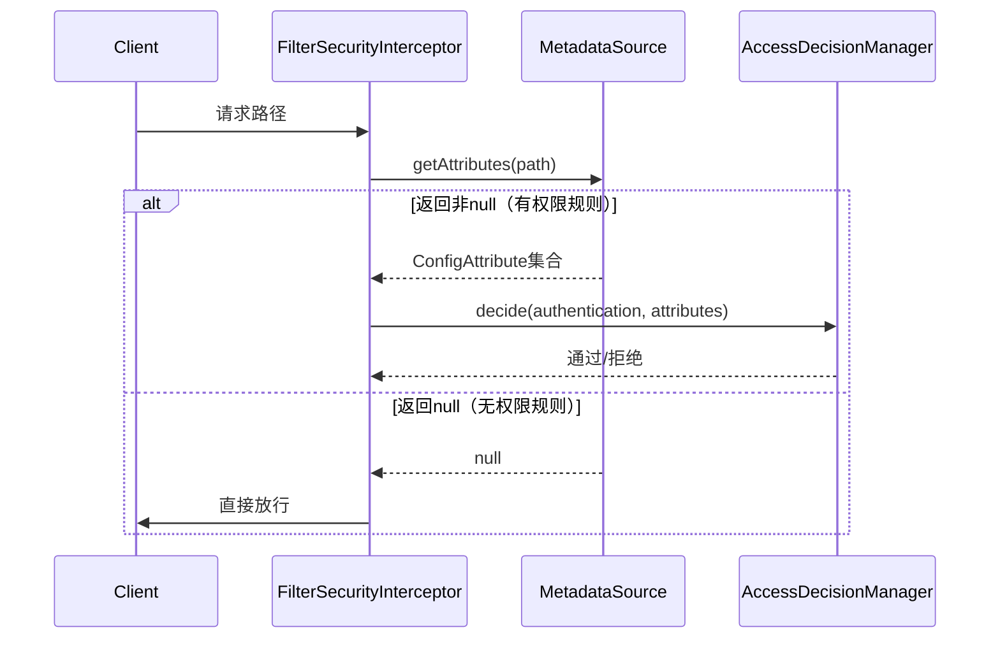

# Issue
- actuator health 检查失败, status 为down。 
  - application.yml配置的service，actuator都会去做health check，确保每个service是可连接的状态

    

- [x] throw AccessDeniedException，但是被AuthenticationEntryPoint而不是AccessDeniedHandler catch住

  > 原因是因为设置了    
  >
  > http.addFilterBefore(jwtAuthenticationTokenFilter, UsernamePasswordAuthenticationFilter.class);
  >
  > http.addFilterAfter(jwtAuthenticationTokenFilter, ExceptionTranslationFilter.class);
  >
  > 导致JWTAuthenticationFilter重复设置并且位置出现在ExceptionTranslationFilter之前，UsernamePasswordAuthenticationFilter之后。
  >
  > 该问题取决于在响应filter - AnonymousAuthenticationFilter时，是否authentication对象为null，如果JWTAuthenticationFilter在其之前，便会将authentication对象设置到SecurityContextHolder中，否则系统会自动 Populated SecurityContextHolder with anonymous token

- [ ] 设计在JwtAuthenticationTokenFilter验证时， token失效重定向到 /users/login 的场景


# Spring Security

## Authentication 机制

```java
// 添加JWT认证过滤器，只在UsernamePasswordAuthenticationFilter之前添加一次
http.addFilterBefore(jwtAuthenticationTokenFilter, UsernamePasswordAuthenticationFilter.class);
```

在`UsernamePasswordAuthenticationFilte`r前添加自定义jwtAuthenticationTokenFilter，确保所以请求，会先走JWT认证，使用token进行验证，提高了效率


```java
http.addFilterAfter(jwtAuthenticationTokenFilter, ExceptionTranslationFilter.class);
```

该代码已被删除，上下两条语句若都执行，会影响jwtAuthenticationTokenFilter的执行顺序。

在`ExceptionTranslationFilter`后添加自定义jwtAuthenticationTokenFilter，确保其抛出的`AuthenticationException`或`AccessDeniedException`会被ExceptionTranslationFilter捕获，将其转换为HTTP响应，比如401未授权或403禁止访问。


Populated SecurityContextHolder with anonymous token: 'AnonymousAuthenticationToken'：

若未通过jwtAuthenticationTokenFilter验证，springsecurity会填充AnonymousAuthenticationToken到SecurityContextHolder中。即便抛出AccessDeniedException：

- AccessDeniedException → 如果用户已认证，使用 [AccessDeniedHandler]AccessDeniedHandlerImpl.java )
- AccessDeniedException → 如果用户未认证（匿名），转换为 InsufficientAuthenticationException（AuthenticationException的子类），使用 [AuthenticationEntryPoint]AuthenticationEntryPointImpl.java )


## Authorization机制 - FilterSecurityInterceptor



## Filter chain list


# Todo
- [ ] 集成Grafana